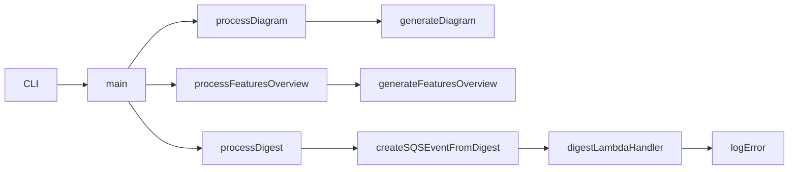

sandbox/docs/CLI_TOOLKIT.md
# sandbox/docs/CLI_TOOLKIT.md
# CLI Toolkit Guide

This document describes the new CLI flags for the Agentic CLI Toolkit.

## Flags

- `--diagram [--format=json|markdown]`
  - Generate a workflow interaction diagram describing how the CLI invokes the SQS Lambda handler.
  - **default**: markdown (mermaid code block)
  - **json**: outputs a JSON object with `nodes`, `links`, and `errors`.

- `--features-overview [--format=json|markdown]`
  - Generate a consolidated overview of archived feature documents under `sandbox/features/archived/`.
  - **default**: markdown (headings and summaries)
  - **json**: outputs a JSON array of `{ name, summary }` objects.

## Usage Examples

### Markdown Diagram
```
$ node sandbox/source/main.js --diagram


### JSON Diagram
```
$ node sandbox/source/main.js --diagram --format=json
{"nodes":["CLI","main","processDiagram","generateDiagram","processFeaturesOverview","generateFeaturesOverview","processDigest","createSQSEventFromDigest","digestLambdaHandler","logError"],"links":[{"from":"CLI","to":"main"},{"from":"main","to":"processDiagram"},{"from":"processDiagram","to":"generateDiagram"},{"from":"main","to":"processFeaturesOverview"},{"from":"processFeaturesOverview","to":"generateFeaturesOverview"},{"from":"main","to":"processDigest"},{"from":"processDigest","to":"createSQSEventFromDigest"},{"from":"createSQSEventFromDigest","to":"digestLambdaHandler"},{"from":"digestLambdaHandler","to":"logError"}],"errors":[]}
```

### Markdown Features Overview
```
$ node sandbox/source/main.js --features-overview
## TestFeature1

This is the first test feature summary.

## TestFeature2

Second feature summary goes here.
```

### JSON Features Overview
```
$ node sandbox/source/main.js --features-overview --format=json
[{"name":"TestFeature1","summary":"This is the first test feature summary."},{"name":"TestFeature2","summary":"Second feature summary goes here."}]
```

### Combined Markdown Output
```
$ node sandbox/source/main.js --diagram --features-overview
```


## TestFeature1

This is the first test feature summary.

## TestFeature2

Second feature summary goes here.
