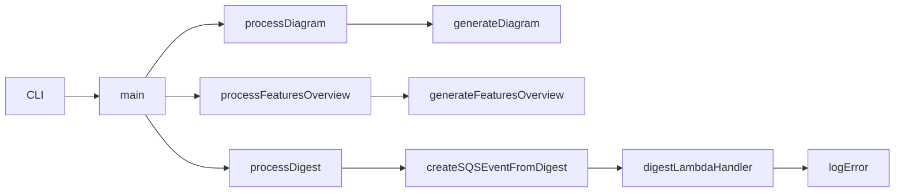

# agentic-lib

Agentic-lib is a JavaScript SDK designed to power automated GitHub workflows with an "agentic" approach, enabling autonomous workflows to communicate through issues and pull requests. It provides CLI utilities, AWS Lambda handlers, and integration tools for seamless orchestration.

For full mission details, see [MISSION.md](../../MISSION.md).

## CLI Toolkit

The CLI supports the following new flags:

- `--diagram [--format=json|markdown]`: Generate a workflow interaction diagram describing CLI → SQS Lambda handler steps.
- `--features-overview [--format=json|markdown]`: Generate an overview of archived feature documents under `sandbox/features/archived/`.
- `--digest`: Simulate an SQS event for a full bucket replay.
- `--version`: Display CLI version and timestamp.
- `--help`: Show help and usage instructions.

### Examples

```bash
$ node sandbox/source/main.js --diagram
```


```bash
$ node sandbox/source/main.js --diagram --format=json
{"nodes":["CLI","main","processDiagram","generateDiagram","processFeaturesOverview","generateFeaturesOverview","processDigest","createSQSEventFromDigest","digestLambdaHandler","logError"],"links":[{"from":"CLI","to":"main"},{"from":"main","to":"processDiagram"},{"from":"processDiagram","to":"generateDiagram"},{"from":"main","to":"processFeaturesOverview"},{"from":"processFeaturesOverview","to":"generateFeaturesOverview"},{"from":"main","to":"processDigest"},{"from":"processDigest","to":"createSQSEventFromDigest"},{"from":"createSQSEventFromDigest","to":"digestLambdaHandler"},{"from":"digestLambdaHandler","to":"logError"}],"errors":[]}
```

```bash
$ node sandbox/source/main.js --features-overview --format=json
[{"name":"TestFeature1","summary":"This is the first test feature summary."}, {"name":"TestFeature2","summary":"Second feature summary goes here."}]
```

```bash
$ node sandbox/source/main.js --diagram --features-overview
```


## TestFeature1

This is the first test feature summary.

## TestFeature2

Second feature summary goes here.

See [docs/CLI_TOOLKIT.md](docs/CLI_TOOLKIT.md) for more details.
