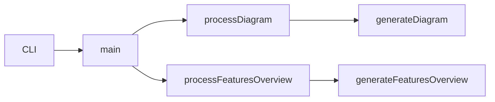

# agentic-lib

agentic-lib is a JavaScript library designed to power automated GitHub Actions workflows with an "agentic" approach, enabling autonomous workflows to communicate through issues and pull requests. For full mission details, see [MISSION.md](../MISSION.md).

## Mission Progress

- Version: 6.3.9-0
- Latest release date: 2025-05-10

## CLI Toolkit

The CLI supports the following flags:

- `--help`
- `--diagram [--format=json|markdown]`
- `--features-overview [--format=json|markdown]`
- `--digest`
- `--version`

## Usage Examples

### Help

```bash
$ node sandbox/source/main.js --help
```

```bash
Usage:
  --help                     Show this help message and usage instructions.
  --diagram [--format=json|markdown]          Generate a workflow interaction diagram describing CLI → SQS Lambda handler steps.
  --features-overview [--format=json|markdown] Generate a consolidated overview of archived feature documents under sandbox/features/archived/.
  --digest                   Run a full bucket replay simulating an SQS event.
  --version                  Show version information with current timestamp.
```

### Diagram (Markdown)

```bash
$ node sandbox/source/main.js --diagram
```

```mermaid
flowchart LR
  CLI --> main
  main --> processDiagram
  processDiagram --> generateDiagram
  main --> processFeaturesOverview
  processFeaturesOverview --> generateFeaturesOverview
```

### Diagram (JSON)

```bash
$ node sandbox/source/main.js --diagram --format=json
{"nodes":["CLI","main","processDiagram","generateDiagram","processFeaturesOverview","generateFeaturesOverview"],"links":[{"from":"CLI","to":"main"},{"from":"main","to":"processDiagram"},{"from":"processDiagram","to":"generateDiagram"},{"from":"main","to":"processFeaturesOverview"},{"from":"processFeaturesOverview","to":"generateFeaturesOverview"}]}
```

### Features Overview (Markdown)

```bash
$ node sandbox/source/main.js --features-overview
```

```bash
## TestFeature1

This is the first test feature summary.

## TestFeature2

Second feature summary goes here.
```

### Features Overview (JSON)

```bash
$ node sandbox/source/main.js --features-overview --format=json
[{"name":"TestFeature1","summary":"This is the first test feature summary."},{"name":"TestFeature2","summary":"Second feature summary goes here."}]
```

### Digest Simulation

```bash
$ node sandbox/source/main.js --digest
{"batchItemFailures":[],"handler":"sandbox/source/main.digestLambdaHandler"}
```

### Version

```bash
$ node sandbox/source/main.js --version
{"version":"6.3.9-0","timestamp":"2025-05-10T16:26:50.335Z"}
```

---

[Contributing](../CONTRIBUTING.md) | [License](..LICENSE.md) | [GitHub](https://github.com/xn-intenton-z2a/agentic-lib)