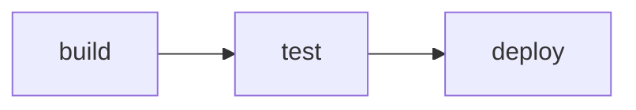

# Objective & Scope

Extend the CLI toolkit to generate an interaction diagram of GitHub Actions workflows defined in the repository. The CLI should parse YAML files under .github/workflows, extract jobs and dependency relationships, and produce a visual representation of the workflow graph.

# Value Proposition

Provides development teams with an automated way to visualize CI/CD pipelines and how jobs depend on each other. This improves maintainability, onboarding, and documentation by enabling clear insights into workflow structure without manual diagramming.

# Success Criteria & Requirements

- Add a new CLI flag --workflow-diagram with optional --format=json or --format=markdown.  
- Default format is markdown output as a Mermaid flowchart code block.  
- JSON format returns an object with nodes (job names) and links (edges from job to its needs).  
- Parse all .github/workflows/*.yml files using js-yaml to identify jobs and their needs arrays.  
- Support repositories with multiple workflow files, merging all jobs into a single graph.  
- Handle circular dependencies gracefully by including them in the errors array of JSON output.

# User Scenarios & Examples

Scenario: A user wants to understand the CI pipeline. They run:

node sandbox/source/main.js --workflow-diagram

This outputs a Mermaid flowchart, for example:

With JSON format:

node sandbox/source/main.js --workflow-diagram --format=json

Returns:
{
  nodes: ["build", "test", "deploy"],
  links: [{ from: "build", to: "test" }, { from: "test", to: "deploy" }],
  errors: []
}

# Verification & Acceptance

- Unit tests provide sample workflow YAML fixtures and validate both markdown and JSON output.  
- Tests cover cases with missing needs fields, single-job workflows, multiple workflows, and cycles.  
- Integration tests ensure the CLI flag triggers the feature and does not affect existing flags.  
- Documentation updates in README and sandbox/docs to illustrate usage.
